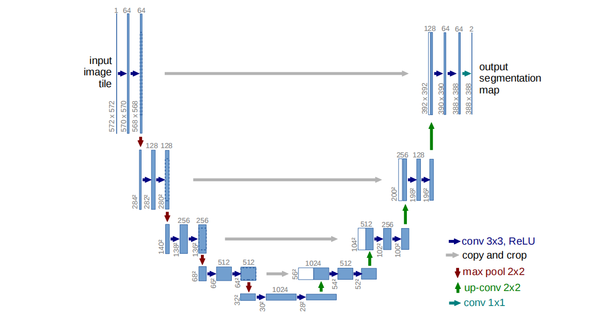

# U-Net: PyTorch Implementation

[](https://pytorch.org/)

This repo is a PyTorch implementation of the original U-Net architecture (Ronneberger et al., 2015) for image segmentation. You can view the original paper [here](https://arxiv.org/pdf/1505.04597.pdf).



## Why this implementation?
- Beginner-Friendly - Clear, modular code and easy to understand.
- Flexible Structure - Easy to modify layers, add new features, or experiment with different architectures.

## How It Works

### Contracting Path (left side):
Each downSample block does: 
```
Conv3x3 → ReLU → Conv3x3 → ReLU → MaxPool2x2  
```
### Expanding Path (right side):
Each upSample block does:
```
2x2 Transpose Conv → Concatenate (skip connection) → 3x3 Conv → ReLU
```

Skip connections copy features from left to right to recover spatial details.
